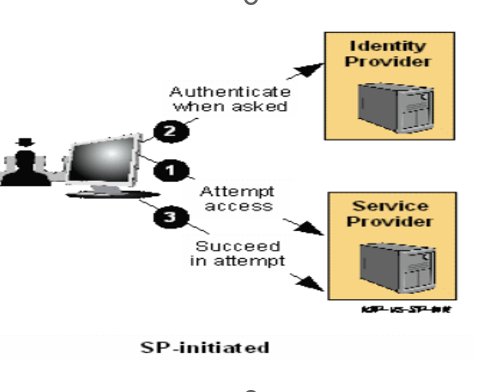
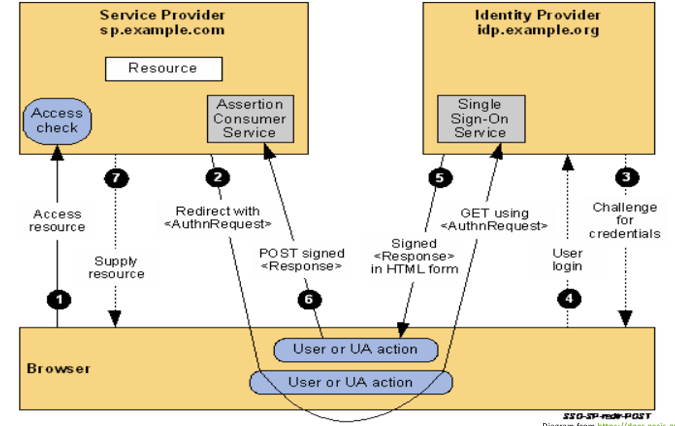
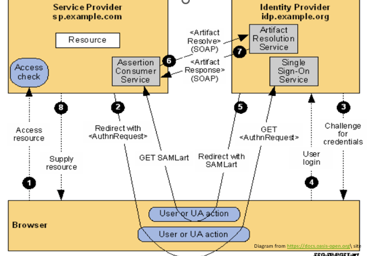
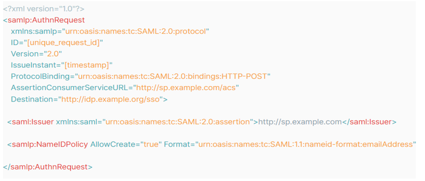
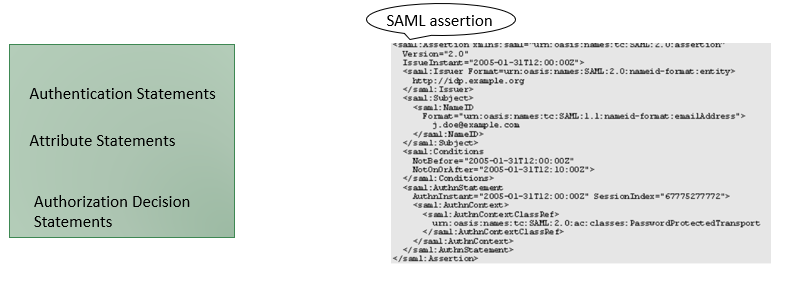

# Day 02 – IAM Beginner Course  
## Single Sign-On (SSO)

---

## What is Single Sign-On (SSO)?

Single Sign-On (SSO) allows a user to log in once and gain access to multiple applications without re-authenticating.

---

## SP-Initiated Flow (SSO)

<!-- IMAGE PLACEHOLDER: SP Initiated SSO Flow Diagram -->
<!-- Insert image file name below -->

---

## Different SSO Protocols

- **SAML 2.0** (since 2005)  
- **OpenID Connect (OIDC)** – Identity layer on top of OAuth 2.0  
  - OAuth 2.0 (since 2012)  
  - OIDC (since 2014)  
  - Uses JSON

---

## SAML (Security Assertion Markup Language)

SAML is an older but widely used authentication protocol.

### Common Use Cases:
- Enterprise systems  
- Government systems  
- Legacy applications  

---

## Key Concepts in SAML

### Identity Provider (IdP)
- Authenticates the user

### Service Provider (SP)
- Provides the application/service

---

## How SAML Works

- Uses **XML-based assertions**
- Relies on **browser redirects**
- Still heavily used for enterprise SSO

---

## What is SAML Binding?

SAML Binding defines how SAML protocol messages are transmitted over the network.

---

## Common SAML Bindings

1. HTTP Redirect Binding  
2. HTTP POST Binding  
3. HTTP Artifact Binding  

---

## POST Binding Flow Diagram

<!-- IMAGE PLACEHOLDER: SAML POST Binding Flow -->

---

## Artifact Binding Flow Diagram

<!-- IMAGE PLACEHOLDER: SAML Artifact Binding Flow -->

---

## SAML Request Example

<!-- IMAGE PLACEHOLDER: SAML Request Example -->

---

## SAML Assertion Sample

<!-- IMAGE PLACEHOLDER: SAML Assertion Sample -->

---

## Configuring SAML

SAML configuration involves exchanging **metadata** between the Identity Provider (IdP) and Service Provider (SP).

---

## What is SAML Metadata?

SAML metadata is an XML document that contains configuration details required to establish trust between IdP and SP.

### It typically includes:

- Entity ID (unique identifier of IdP/SP)
- Assertion Consumer Service (ACS) URL
- Single Logout Service (SLO) URL
- Supported bindings (POST, Redirect, etc.)
- Public certificates (used for signing and encryption)

---

## Why Metadata is Important

- Eliminates manual configuration errors  
- Establishes trust securely  
- Enables interoperability between systems  

---

## Summary

- SSO improves user experience and security  
- SAML is widely used in enterprise environments  
- Bindings define how messages are transported  
- Metadata is critical for configuration and trust setup  

---