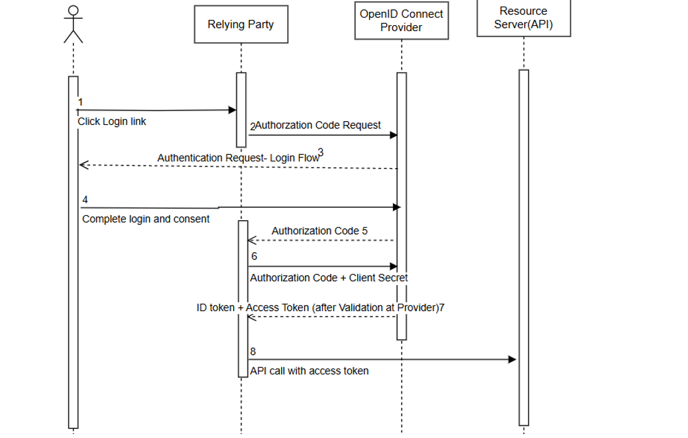

# Day 05 – IAM Beginner Course  
## OIDC Grant Flows, Authentication & Authorization

---

## OIDC Grant Flows (Continued)

---

## Authorization Code Flow

Used in **backend applications** where client secret confidentiality can be maintained.

---

### Flow Diagram

<!-- IMAGE PLACEHOLDER: Authorization Code Flow Diagram -->


---

### cURL Example – Authorize Endpoint

> Note: `/authorize` is typically invoked via browser redirect. Below is a conceptual example.

```
GET https://YOUR_DOMAIN/authorize?
response_type=code&
client_id=YOUR_CLIENT_ID&
redirect_uri=https://your-app.com/callback&

scope=openid profile email&
state=xyz123
```
---

### cURL Example – Token Endpoint

```bash
curl --request POST \
  --url https://YOUR_DOMAIN/oauth/token \
  --header 'content-type: application/json' \
  --data '{
    "grant_type": "authorization_code",
    "client_id": "YOUR_CLIENT_ID",
    "client_secret": "YOUR_CLIENT_SECRET",
    "code": "AUTHORIZATION_CODE",
    "redirect_uri": "https://your-app.com/callback"
}
```

---

## Authorization Code Flow + PKCE

Used in:

- Frontend (SPA) applications
- Mobile applications

👉 Because client secret cannot be securely stored ..

## Flow Diagram
<!-- IMAGE PLACEHOLDER: Authorization Code Flow with PKCE Diagram -->

## cURL Example – Authorize Endpoint (PKCE)  
```
GET https://YOUR_DOMAIN/authorize?
  response_type=code&
  client_id=YOUR_CLIENT_ID&
  redirect_uri=https://your-app.com/callback&
  scope=openid profile email&
  code_challenge=CODE_CHALLENGE&
  code_challenge_method=S256&
  state=xyz123
```

## cURL Example – Token Endpoint (PKCE)  
```
curl --request POST \
  --url https://YOUR_DOMAIN/oauth/token \
  --header 'content-type: application/json' \
  --data '{
    "grant_type": "authorization_code",
    "client_id": "YOUR_CLIENT_ID",
    "code": "AUTHORIZATION_CODE",
    "redirect_uri": "https://your-app.com/callback",
    "code_verifier": "CODE_VERIFIER"
}
```
---

## Note on OAuth 2.1

- OAuth 2.1 recommends:
  - Authorization Code Flow + PKCE (even for backend apps)  
- Client Secret + PKCE combination is supported conceptually  
- Some libraries may not yet fully support this  

---

## Authentication Phase

Authentication verifies **who the user is**.

---

## Common Authentication Methods

- Password-based authentication  
- Multi-Factor Authentication (MFA)  
- Passkeys (passwordless authentication)  

---

## Multi-Factor Authentication (MFA)

MFA requires multiple verification factors:

### Types of Factors

#### 1. Something you know
- Password  
- PIN  

#### 2. Something you have
- OTP via SMS/email  
- Authenticator apps (e.g., Google Authenticator)  

#### 3. Something you are
- Biometrics (fingerprint, face recognition)  

---

## Passkeys

- Passwordless authentication method  
- Based on public-private key cryptography  
- Private key stored securely on user device  
- Used by modern platforms (WebAuthn)  

---

## Token Issuance

After successful authentication:

- In **OIDC** → ID Token + Access Token sent to Relying Party  
- In **SAML** → SAML Assertion sent to Service Provider  

---

## Token Contents

Tokens contain claims such as:

- `sub` (user ID)  
- `aud` (audience)  
- `exp` (expiry)  
- Custom claims (if configured)  

---

## Custom Scopes and Claims

If custom scope is requested:  
```
scope=openid profile email custom_scope
```

- Corresponding claims will be added to token (if configured)  

---

## Authorization Concepts

---

## Role-Based Access Control (RBAC)

- Access based on **roles**

### Example
- Admin  
- User  
- Manager  

---

## Attribute-Based Access Control (ABAC)

- Access based on **attributes**

### Example
- User department  
- Location  
- Time of access  

---

## RBAC vs ABAC

| Feature     | RBAC        | ABAC                          |
|------------|------------|-------------------------------|
| Based on   | Roles       | Attributes                    |
| Flexibility| Limited     | High                          |
| Complexity | Simple      | Complex                       |
| Example    | Admin access| Access only during office hours|

---

## Scope vs Claims

### Scope
- Requested by client  
- Defines **what access is needed**  

### Claims
- Present inside token  
- Provide **information about user or access**  

---

## Important Note

By default:

- OAuth/OIDC tokens  
- SAML assertions  

👉 Contain **authentication details only**

---

## Adding Roles and Custom Claims

Requires configuration at Identity Provider:

- Add roles to tokens  
- Add custom claims  
- Customize token content  

---

## Token Customization

Typically done using:

- Post-login actions/hooks  
- Rules (legacy approach)  

### Used to:

- Add roles  
- Add custom attributes  
- Modify token structure  

---

## Resource Server Authorization

When API receives request:

1. Validate access token  
2. Verify signature  
3. Check claims / roles  
4. Grant or deny access  

---

## Illustration: API Access using RBAC

### Example using Auth0

- User logs in  
- Token contains roles  
- API checks:
  - Role = `admin`  
- Access granted accordingly  

---

### Diagram

<!-- IMAGE PLACEHOLDER: RBAC API Access Flow using Auth0 -->


---

## Summary

- Authorization Code Flow used for backend apps  
- PKCE used for frontend/mobile apps  
- OAuth 2.1 promotes PKCE usage  
- Authentication methods include password, MFA, passkeys  
- Tokens carry claims and identity data  
- RBAC and ABAC control authorization  
- Scopes define access, claims carry data  
- Token customization is required for roles/attributes  
- Resource Server enforces access control  


