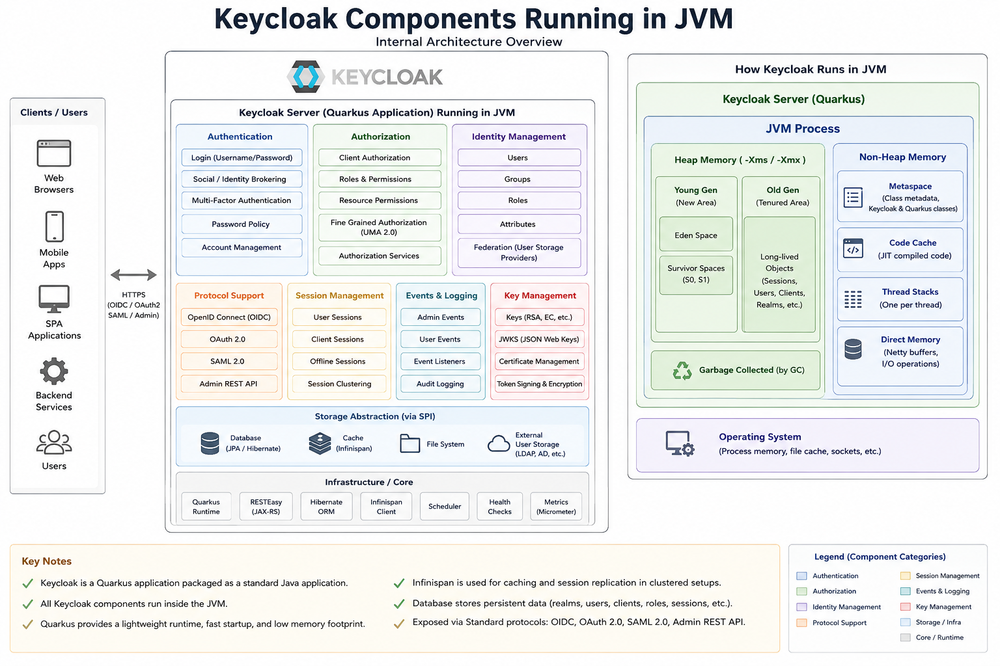
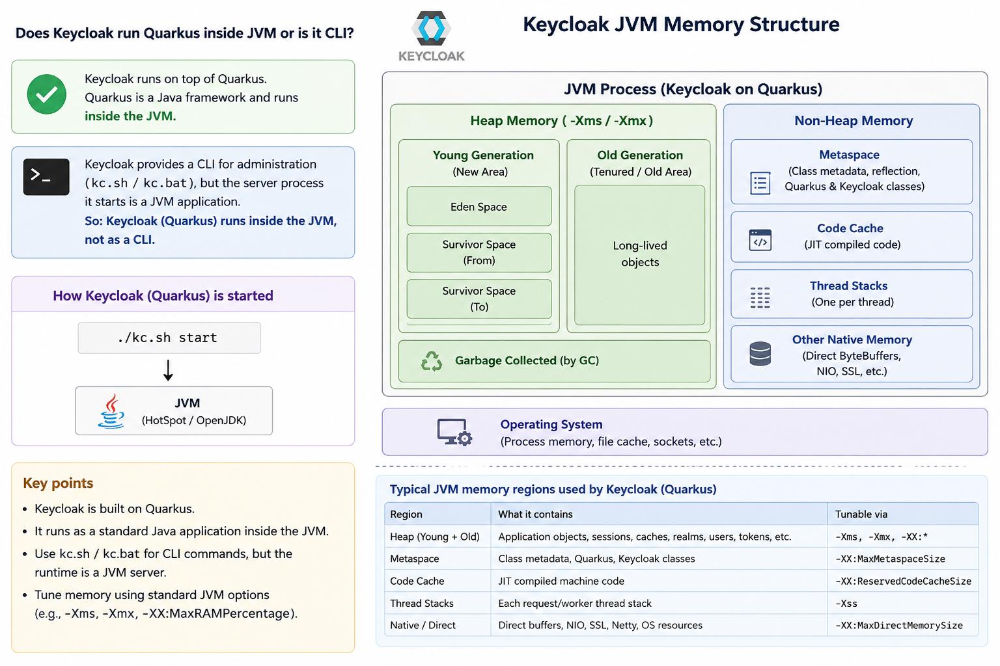

# Keycloak Runtime Architecture Notes

## Understanding Quarkus, Vert.x, JVM Memory, and Deployment Structure

<!-- Insert image file name below -->


---

# 1. Does Keycloak Run Inside JVM or as a CLI?

Keycloak is a Java application built on top of Quarkus.

Although administrators start Keycloak using:

```bash
kc.sh start
```

or

```cmd
kc.bat start
```

the CLI script is only a launcher.

The actual Keycloak server runs as a standard Java application inside a JVM.

Conceptually:

```text
kc.sh start
      |
      v
Java Process (JVM)
      |
      v
Quarkus Runtime
      |
      v
Keycloak Server
```

Therefore:

* Keycloak is NOT a CLI application.
* Keycloak is a JVM application.
* The CLI is only used to start and manage the server.

---

# 2. Role of Quarkus

Quarkus provides the runtime framework on which Keycloak is built.

Responsibilities include:

* Dependency Injection (CDI / Arc)
* REST framework (RESTEasy Reactive)
* Configuration management
* Health checks
* Metrics
* Hibernate integration
* Startup optimization
* Native image support (not used by Keycloak)

Think of Quarkus as the application framework that hosts Keycloak.

---

# 3. Role of Vert.x

Vert.x is the networking and HTTP layer used by Quarkus.

Vert.x runs inside the same JVM process as Keycloak.

It is NOT a separate server process.

Architecture:

```text
JVM
 |
 +-- Keycloak
 |
 +-- Quarkus Runtime
 |
 +-- Vert.x HTTP Server
 |
 +-- Hibernate ORM
 |
 +-- Infinispan Cache
 |
 +-- RESTEasy Reactive
```

---

# 4. Request Processing Flow

When a browser accesses Keycloak:

```text
Browser
   |
   v
Vert.x HTTP Server
   |
   v
Quarkus Routing
   |
   v
RESTEasy Reactive
   |
   v
Keycloak Endpoint
   |
   v
Authentication Flow
   |
   v
Database / Cache
   |
   v
Response
```

Everything executes within the same JVM process.

---

# 5. JVM Memory Layout

```text
JVM Process
|
+-- Heap Memory
|     |
|     +-- Young Generation
|     +-- Old Generation
|
+-- Metaspace
|     |
|     +-- Keycloak Classes
|     +-- Quarkus Classes
|     +-- Vert.x Classes
|
+-- Thread Stacks
|     |
|     +-- Vert.x Event Loop Threads
|     +-- Worker Threads
|     +-- Scheduled Tasks
|
+-- Native Memory
      |
      +-- SSL Buffers
      +-- NIO Buffers
      +-- Network Buffers
```

---

# 6. What Lives in the Heap?

Typical Keycloak objects:

* Realms
* Clients
* Users
* Groups
* Roles
* Sessions
* Authentication contexts
* Tokens
* Cache entries

---

# 7. Why Does Quarkus Use Vert.x?

Vert.x provides:

* Event-driven architecture
* Non-blocking I/O
* Fast startup
* Low memory consumption
* High throughput

This is one reason modern Keycloak starts significantly faster than older WildFly-based versions.

---

# 8. What Happens When kc.sh Start Is Executed?

Conceptually:

```bash
java \
  -Xms512m \
  -Xmx2g \
  -jar keycloak.jar
```

Inside the JVM:

```text
JVM
 |
 +-- Vert.x
 +-- Quarkus
 +-- Hibernate
 +-- Infinispan
 +-- RESTEasy Reactive
 +-- Keycloak
```

All components run inside a single Java process.

---

# 9. Keycloak Deployment Directory Structure

Typical Keycloak 26.x distribution:

```text
keycloak/
|
+-- bin/
+-- conf/
+-- data/
+-- lib/
+-- providers/
+-- themes/
+-- VERSION
+-- LICENSE.txt
```

---

# 10. bin Directory

Contains startup scripts.

```text
bin/
|
+-- kc.sh
+-- kc.bat
```

Examples:

```bash
kc.sh start
kc.sh start-dev
kc.sh build
kc.sh export
kc.sh import
```

Purpose:

* Server startup
* Build optimized image
* Import/export operations
* Administrative commands

---

# 11. conf Directory

Contains configuration files.

```text
conf/
|
+-- keycloak.conf
+-- cache-ispn.xml
+-- truststores/
```

Example:

```properties
db=postgres
db-url=jdbc:postgresql://localhost:5432/keycloak
db-username=postgres
db-password=secret
```

Purpose:

* Database configuration
* Cache configuration
* TLS certificates
* Cluster configuration

---

# 12. data Directory

Contains runtime-generated data.

```text
data/
|
+-- tmp/
+-- transaction-logs/
+-- import/
```

Example:

```text
data/import/realm-export.json
```

Used by:

```bash
kc.sh start --import-realm
```

---

# 13. lib Directory

One of the most important directories for understanding runtime internals.

```text
lib/
|
+-- lib/main/
```

Contains hundreds of JAR files:

```text
keycloak-services.jar
keycloak-server-spi.jar
keycloak-model-jpa.jar
hibernate-core.jar
quarkus-*.jar
vertx-*.jar
```

This directory contains:

* Keycloak implementation classes
* Quarkus runtime classes
* Vert.x classes
* Hibernate ORM classes
* Third-party dependencies

These JARs are loaded into the JVM during startup.

---

# 14. providers Directory

Contains custom extensions.

```text
providers/
|
+-- my-authenticator.jar
+-- my-event-listener.jar
+-- my-user-storage-provider.jar
```

After adding a provider:

```bash
kc.sh build
```

Typical extensions:

* Authenticators
* User Storage Providers
* Event Listeners
* Protocol Mappers
* Custom REST APIs

---

# 15. themes Directory

Contains UI customizations.

```text
themes/
|
+-- mytheme/
      |
      +-- login/
      +-- account/
      +-- admin/
      +-- email/
```

Used to customize:

* Login pages
* Account Console
* Email templates
* Admin UI themes

---

# 16. Internal Runtime View

When Keycloak is running:

```text
JVM
|
+-- Vert.x HTTP Server
|
+-- Quarkus Runtime
|
+-- RESTEasy Reactive
|
+-- Keycloak Services
|     |
|     +-- Authentication
|     +-- Authorization
|     +-- User Federation
|     +-- Session Management
|     +-- Token Generation
|
+-- Hibernate ORM
|
+-- Infinispan Cache
|
+-- PostgreSQL Driver
|
+-- Custom Providers
```

---

# 17. Source Code Understanding Roadmap

If your goal is to understand Keycloak internals, focus on these modules:

## 1. keycloak-services

Contains:

* Authentication flows
* Login processing
* REST endpoints
* Token endpoints

Most business logic lives here.

---

## 2. keycloak-server-spi

Contains:

* Extension interfaces
* SPI definitions

Examples:

* Authenticator SPI
* User Storage SPI
* Event Listener SPI

---

## 3. keycloak-server-spi-private

Contains internal SPIs used by Keycloak itself.

Advanced area for contributors.

---

## 4. keycloak-model-jpa

Contains:

* Hibernate entities
* Persistence layer
* Database interactions

Important for understanding how realms, users, clients, and roles are stored.

---

## 5. keycloak-themes

Contains:

* FreeMarker templates
* Theme resources
* UI rendering logic

---

## 6. org.keycloak.quarkus.runtime

Contains:

* Keycloak-specific Quarkus integration
* Startup logic
* Configuration handling
* Bootstrap process

This is the bridge between Quarkus and Keycloak.

---

## 7. Quarkus Runtime

Provides:

* CDI container
* REST layer
* Configuration subsystem
* HTTP infrastructure

Generally not modified by Keycloak developers but important for understanding runtime behavior.

---

# 18. Mental Model for Reading Keycloak Source

Keep this picture in mind:

```text
Browser
   |
   v
Vert.x
   |
   v
Quarkus
   |
   v
RESTEasy Reactive
   |
   v
Keycloak Services
   |
   +--> Authentication
   +--> Authorization
   +--> User Federation
   +--> Sessions
   +--> Tokens
   |
   v
Hibernate
   |
   v
PostgreSQL
```

<!-- Insert image file name below -->


If you understand this flow and the following modules:

* keycloak-services
* keycloak-server-spi
* keycloak-model-jpa
* org.keycloak.quarkus.runtime

you will understand approximately 80% of the Keycloak runtime architecture.

<!-- Insert image file name below -->
  