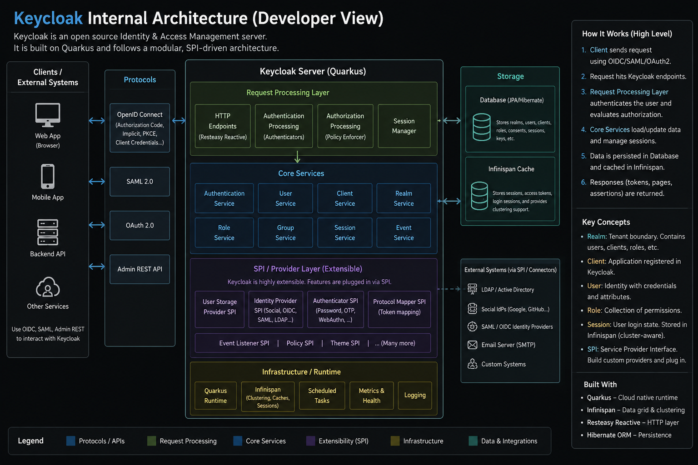

# Keycloak Internal Architecture (Developer Perspective)

  

## Overview

:contentReference[oaicite:0]{index=0} is an open-source Identity and Access Management (IAM) platform.

Modern Keycloak versions are built on:
- Quarkus runtime
- RESTEasy Reactive
- Hibernate/JPA
- Infinispan distributed cache

Keycloak internally follows a:
- Modular architecture
- SPI-driven extension model
- Protocol abstraction layer

---

# High-Level Architecture

```text
+------------------------------------------------------+
|                External Clients                      |
|------------------------------------------------------|
| Web Apps | Mobile Apps | APIs | Microservices        |
+-------------------------+----------------------------+
                          |
                          v
+------------------------------------------------------+
|                  Protocol Layer                      |
|------------------------------------------------------|
| OIDC | OAuth2 | SAML | Admin REST APIs               |
+-------------------------+----------------------------+
                          |
                          v
+------------------------------------------------------+
|            Request Processing Layer                  |
|------------------------------------------------------|
| HTTP Endpoints                                       |
| Authentication Engine                                |
| Authorization Engine                                 |
| Session Management                                   |
+-------------------------+----------------------------+
                          |
                          v
+------------------------------------------------------+
|                  Core Services                       |
|------------------------------------------------------|
| User Service                                         |
| Realm Service                                        |
| Client Service                                       |
| Role Service                                         |
| Group Service                                        |
| Session Service                                      |
| Event Service                                        |
+-------------------------+----------------------------+
                          |
                          v
+------------------------------------------------------+
|              SPI / Provider Layer                    |
|------------------------------------------------------|
| Authenticator SPI                                    |
| User Storage SPI                                     |
| Identity Provider SPI                                |
| Protocol Mapper SPI                                  |
| Event Listener SPI                                   |
| Theme SPI                                            |
+-------------------------+----------------------------+
                          |
                          v
+------------------------------------------------------+
|                 Storage Layer                        |
|------------------------------------------------------|
| Relational Database                                  |
| Infinispan Cache                                     |
+------------------------------------------------------+
```

---

# 1. External Clients and Protocols

Applications interact with Keycloak using standard authentication protocols.

## Supported Clients

- Browser applications
- Mobile applications
- Backend APIs
- Microservices
- Third-party identity providers

## Supported Protocols

- OpenID Connect (OIDC)
- OAuth 2.0
- SAML 2.0
- Admin REST API

---

# 2. Request Processing Layer

This layer handles incoming requests.

## Responsibilities

- Receive HTTP requests
- Execute authentication flows
- Process authorization policies
- Manage sessions
- Generate tokens

---

## HTTP Endpoints

Modern Keycloak uses:
- RESTEasy Reactive
- Quarkus HTTP stack

Examples:

```text
/realms/{realm}
/protocol/openid-connect/token
/admin/realms
```

---

## Authentication Engine

The authentication engine executes configurable authentication flows.

Examples:
- Username/password login
- OTP
- WebAuthn
- Conditional authentication
- Identity brokering

Authentication flows internally execute:
- Executions
- Authenticators
- Required actions

Example execution chain:

```text
UsernamePasswordForm
   ↓
OTPFormAuthenticator
   ↓
ConditionalRoleAuthenticator
```

---

## Authorization Engine

Processes:
- Policies
- Permissions
- Resource-based authorization

Used heavily in:
- UMA
- Fine-grained authorization services

---

## Session Manager

Maintains:
- User sessions
- Client sessions
- Offline sessions
- Authentication sessions

Sessions are cached in:
- Infinispan

Persisted in:
- Relational database

---

# 3. Core Services Layer

This layer contains the primary business logic.

---

## Realm Service

Manages:
- Realms
- Realm settings
- Realm keys
- Security policies

A realm acts as a tenant boundary.

---

## User Service

Handles:
- User CRUD
- Credentials
- Federated identities
- User attributes

---

## Client Service

Manages:
- OIDC clients
- SAML clients
- Redirect URIs
- Client scopes
- Secrets

---

## Role Service

Handles:
- Realm roles
- Client roles
- Composite roles

---

## Group Service

Supports:
- User grouping
- Hierarchical groups
- Role inheritance

---

## Session Service

Maintains:
- SSO sessions
- Token sessions
- Logout propagation

---

## Event Service

Captures:
- Login events
- Admin events
- Failures
- Security activities

---

# 4. SPI / Provider Architecture

This is the most important area for Keycloak developers.

SPI = Service Provider Interface

Keycloak internally uses plugins extensively.

Developers can extend Keycloak by creating custom providers.

---

# Important SPIs

---

## Authenticator SPI

Used for:
- Custom login forms
- Additional validations
- Custom MFA
- Device validation
- Geo restrictions

Important interfaces:

```java
Authenticator
AuthenticatorFactory
```

---

## User Storage SPI

Used for external user stores.

Examples:
- LDAP
- Active Directory
- HR databases
- Legacy systems

Example:

```java
UserStorageProvider
UserLookupProvider
CredentialInputValidator
```

---

## Identity Provider SPI

Supports:
- Social login
- Enterprise federation
- External IdPs

Examples:
- Google
- GitHub
- Azure AD

---

## Protocol Mapper SPI

Used to customize JWT claims.

Example:

```json
{
  "department": "finance",
  "employeeId": "EMP1001"
}
```

---

## Event Listener SPI

Captures events for:
- SIEM systems
- Audit logging
- Notifications
- Monitoring

---

## Theme SPI

Allows customization of:
- Login UI
- Account console
- Emails
- Admin console

---

# 5. Storage Layer

Keycloak uses both persistent storage and distributed caching.

---

## Relational Database

Common databases:
- PostgreSQL
- MySQL
- MariaDB
- Oracle

Stores:
- Users
- Roles
- Clients
- Realms
- Configurations
- Persistent sessions

Internally uses:
- Hibernate ORM
- JPA

---

## Infinispan Cache

Used for:
- Sessions
- Tokens
- Realm cache
- User cache
- Cluster synchronization

Benefits:
- Reduced DB access
- Faster authentication
- Cluster-aware session replication

---

# 6. Internal Authentication Flow

Typical internal login flow:

```text
Client Application
        ↓
OIDC Endpoint
        ↓
Authentication Flow Engine
        ↓
Executions Run Sequentially
        ↓
Authenticators Execute
        ↓
User Session Created
        ↓
Token Manager Generates JWT
        ↓
Response Returned
```

---

# 7. Token Generation Internals

After successful authentication:

## Token Manager

Generates:
- Access token
- ID token
- Refresh token

---

## Protocol Mappers

Add claims dynamically.

Examples:
- Roles
- Groups
- User attributes
- Custom claims

---

## Signing Layer

JWTs are signed using:
- RSA keys
- EC keys

Keys belong to:
- Realm key providers

---

# 8. Clustering Architecture

Production deployments usually run multiple Keycloak nodes.

```text
                Load Balancer
                      |
        +-------------+-------------+
        |             |             |
        v             v             v
+---------------+ +---------------+ +---------------+
| Keycloak #1   | | Keycloak #2   | | Keycloak #3   |
+---------------+ +---------------+ +---------------+
        |             |             |
        +-------------+-------------+
                      |
                      v
            Shared Relational DB
                      |
                      v
         Distributed Infinispan Cache
```

---

## Benefits

- High availability
- Horizontal scaling
- Session failover
- Better performance

---

# 9. Extension Deployment Model

Custom providers are deployed as JAR files.

Typical deployment:

```text
Custom Provider
      ↓
Compile JAR
      ↓
Place in providers/
      ↓
Run kc.sh build
      ↓
Restart Keycloak
```

Provider discovery uses:

```text
META-INF/services
```

---

# 10. Internal Runtime Components

Modern Keycloak internally includes:

| Component | Purpose |
|---|---|
| Quarkus | Runtime |
| RESTEasy Reactive | HTTP layer |
| Hibernate | ORM |
| Infinispan | Distributed cache |
| Agroal | DB connection pool |
| JGroups | Cluster communication |
| SmallRye | Metrics & health |

---

# 11. Developer-Relevant Internal Concepts

---

## Authentication Flow Engine

Very important for customization.

Key concepts:
- Flows
- Executions
- Requirements
- Authenticators

Requirement types:
- REQUIRED
- ALTERNATIVE
- CONDITIONAL
- DISABLED

---

## Required Actions

Triggered after authentication.

Examples:
- Update password
- Configure OTP
- Verify email

---

## Client Scopes

Used to control:
- Token claims
- Protocol mappers
- Role inclusion

---

## Realm Isolation

Each realm contains:
- Users
- Roles
- Clients
- Sessions
- Identity providers

Realms are isolated from one another.

---

# 12. Developer Perspective Summary

Internally, Keycloak is essentially:

```text
Protocol Engine
+ Authentication Workflow Engine
+ Token Service
+ Session Manager
+ SPI Plugin Platform
+ Identity Federation Hub
+ Distributed Cache System
```

---

# Most Important Topics for Keycloak Developers

## Essential Areas

1. Authentication Flows
2. Authenticator SPI
3. User Storage SPI
4. OIDC Internals
5. Token Mapping
6. Session Management
7. Identity Brokering
8. Clustering
9. Event Listeners
10. Authorization Services

---

# Recommended Internal Learning Path

## Beginner

- Realms
- Clients
- Users
- Roles
- OIDC basics

## Intermediate

- Authentication flows
- Protocol mappers
- Token internals
- Identity brokering

## Advanced

- Authenticator SPI
- User federation
- Custom providers
- Clustering internals
- Authorization services

---