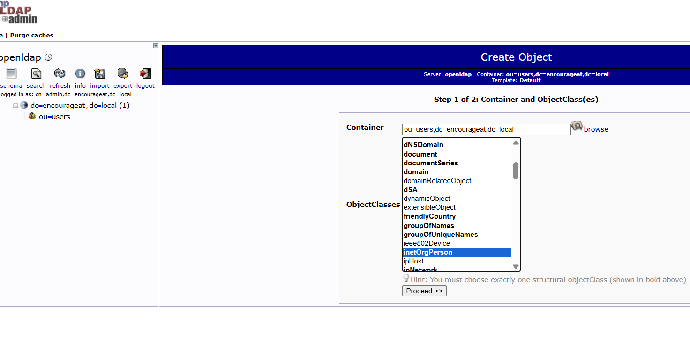
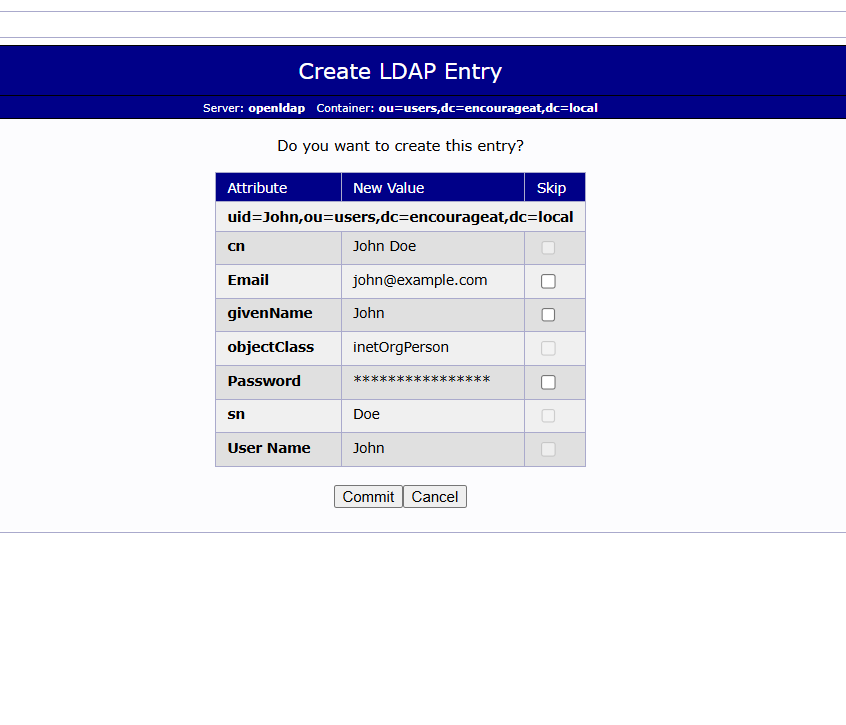

# User Federation in Keycloak

## Install (OpenLDAP, PHP Ldap Admin and Keycloak)  

compose.yaml

```
version: '3.8'

services:

  openldap:
      image: osixia/openldap:1.5.0
      container_name: openldap
      environment:
        LDAP_ORGANISATION: "EncourageAt"
        LDAP_DOMAIN: "encourageat.local"
        LDAP_ADMIN_PASSWORD: admin
      ports:
        - "389:389"
        - "636:636"
      volumes:
        - ldap_data:/var/lib/ldap
        - ldap_config:/etc/ldap/slapd.d

  volumes:
    ldap_data:
    ldap_config:
    
  phpldapadmin:
    image: osixia/phpldapadmin:0.9.0
    container_name: phpldapadmin
    environment:
      PHPLDAPADMIN_LDAP_HOSTS: openldap
      PHPLDAPADMIN_HTTPS: "false"
    ports:
      - "8081:80"
    depends_on:
      - openldap

  keycloak:
    image: quay.io/keycloak/keycloak:latest
    container_name: keycloak
    command: start-dev
    environment:
      KEYCLOAK_ADMIN: admin
      KEYCLOAK_ADMIN_PASSWORD: admin
    ports:
      - "8080:8080"
```

After startup:  

Keycloak → http://localhost:8080  
phpLDAPadmin → http://localhost:8081

LDAP admin login:

```
Login DN:
cn=admin,dc=encourageat,dc=local

Password:
admin
```

## Create LDAP Users

Create an Organizational Unit  

On left tree:  

```
dc=encourageat,dc=local
```

Choose:

```
Generic: Organizational Unit
```

Enter:  

```
ou: users
```

Create it.  

Now your structure becomes:  

```
dc=encourageat,dc=local
 └── ou=users
```

Create User
1. Click your OU

Example:  

ou=users  
2. Click  
Create a child entry  
3. Choose  
Default -> InetOrgPerson  
4. Fill only simple attributes  

---



---

Example:  

```
RDN: User Name (uid)  

cn: John Doe
sn: Doe
givenName: John
uid: john
mail: john@example.com
userPassword: password
```

---



---

Resulting LDAP DN will become something like:  

```
uid=john,ou=users,dc=encourageat,dc=local
```

Complete creation.  

Repeat for other users.  

## Configure LDAP Federation in Keycloak  

Open Keycloak Admin Console within the desired realm.  

Navigate to:  

User Federation  

Add LDAP provider and configure similar to below:  

```
Vendor: Other

Connection URL:
ldap://openldap:389

Bind DN:
cn=admin,dc=encourageat,dc=local

Bind Credential:
admin

Users DN:
ou=users,dc=encourageat,dc=local

Username LDAP attribute:
uid

RDN LDAP attribute:
uid

UUID LDAP attribute:
entryUUID

User Object Classes:
inetOrgPerson
```

Then click:

Test connection
Test authentication

Save the configuration.

Synchronize LDAP Users

After saving:

User Federation
  -> Your LDAP Provider
      -> Synchronize all users

LDAP users should now appear in Keycloak.

Test Login

Example:

Username: john
Password: password

Keycloak should authenticate successfully against LDAP.

