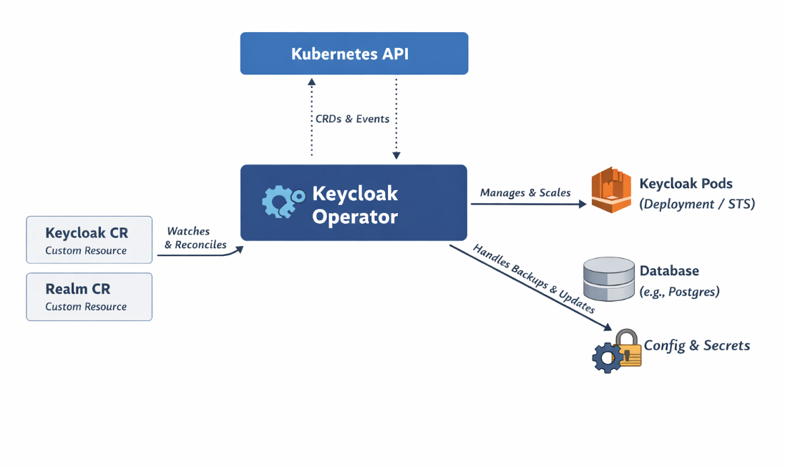

# Keycloak Operator – Architecture & Interactions

## Overview

The Keycloak Operator is a Kubernetes-native controller that manages the lifecycle of Keycloak deployments using a **declarative approach**.

Instead of manually creating Deployments, Services, and configurations, you define the desired state using **Custom Resources (CRs)**, and the operator ensures that state is maintained.

---



---

## Key Components in the Architecture

### 1. Kubernetes API Server

- Central control plane of Kubernetes
- Stores:
  - Custom Resources (CRs)
  - Events
  - Cluster state
- Acts as the communication hub for the operator

---

### 2. Keycloak Operator

- A controller running inside Kubernetes
- Watches for changes in Custom Resources
- Performs reconciliation to match desired state with actual state

**Core Responsibility:**
> Continuously ensure that the Keycloak deployment matches the declared configuration

---


### 3. Custom Resources (CRs)

#### a. Keycloak CR
Defines:
- Number of replicas
- Database configuration
- Resource limits
- Image version

#### b. Realm CR (Optional)
Defines:
- Realms
- Clients
- Users
- Roles

---

### 4. Keycloak Pods

- Managed by the operator
- Typically deployed as:
  - Deployment OR
  - StatefulSet
- Scaled and updated automatically

---

### 5. Database (e.g., PostgreSQL)

- Stores:
  - Users
  - Sessions
  - Configuration
- Operator configures connectivity and lifecycle (depending on setup)

---

### 6. ConfigMaps & Secrets

- Store:
  - Configuration
  - Credentials (DB password, admin password, etc.)
- Managed and injected into pods by the operator

---

## Interaction Flow (Step-by-Step)

### Step 1: User Defines Desired State

You create a Keycloak Custom Resource:

```yaml
apiVersion: k8s.keycloak.org/v2alpha1
kind: Keycloak
metadata:
  name: my-keycloak
spec:
  instances: 3
  image: quay.io/keycloak/keycloak:24.0.3
```

## Step 2: Operator Watches the Resource

Operator continuously watches:
- Keycloak CR
- Realm CR  

Uses Kubernetes watch mechanism via API Server

---

## Step 3: Reconciliation Loop

When a change is detected:

### Operator compares:
- Desired state (CR)
- Actual state (running cluster)

### Takes corrective action:
- Creates/updates Deployment
- Configures Services
- Injects ConfigMaps/Secrets

---

## Step 4: Resource Creation

Operator creates:
- Pods (Keycloak instances)
- Services (for access)
- ConfigMaps (configuration)
- Secrets (credentials)

---

## Step 5: Continuous Monitoring

Operator keeps monitoring:
- Pod health
- Replica count
- Configuration drift

### If mismatch occurs:
- Operator automatically fixes it

---

## Step 6: Scaling & Updates

### Scaling Example

```yaml
spec:
  instances: 5
```

→ Operator scales pods to 5

---

## Update Example

```
spec:
  image: quay.io/keycloak/keycloak:25.0.0
```

→ Operator performs rolling update

## Step 7: Realm Management (Optional)

Realm CR allows declarative IAM configuration.

### Operator provisions:
- Realms  
- Clients  
- Roles  
- Users  

---

## Key Concept: Reconciliation Loop

The most important concept:

> The operator continuously ensures  
> **Actual State = Desired State**

This loop never stops.

---

## What Happens Internally

### Operator Interacts With:

- Kubernetes API → Watch & update resources  
- Keycloak Pods → Health & lifecycle  
- Database → Connectivity setup  
- Secrets → Secure configuration  

---

## Benefits of This Model

### 1. Declarative Configuration
- No manual steps  
- Everything defined as YAML  

---

### 2. Self-Healing
- Pods crash → Operator recreates  
- Config drift → Operator fixes  

---

### 3. Automation
- Scaling  
- Updates  
- Configuration management  

---

### 4. Consistency
- Same setup across environments  
- Dev / QA / Prod alignment  

---

## Real-World Analogy

Think of the operator as:

> A DevOps engineer running 24/7, constantly checking:

- “Are there 3 Keycloak pods running?”  
- “Is the correct version deployed?”  
- “Is configuration correct?”  

If not → it fixes automatically.

---

## When to Use Keycloak Operator

### Use it when:
- Running Keycloak in production Kubernetes  
- You need automation and reliability  
- Managing multiple environments  
- Want GitOps-style deployments  

---

### Avoid it when:
- Learning basics (start with manifests)  
- Very simple, one-off deployments  

---

## Summary

- Operator watches Custom Resources  
- Uses reconciliation loop  
- Manages pods, configs, scaling, and updates  
- Provides automation and reliability  
- Ideal for production-grade Keycloak deployments  

