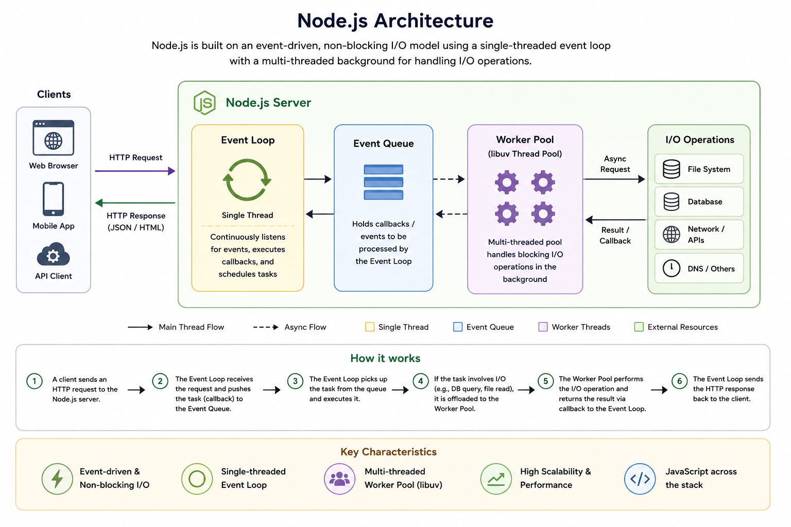
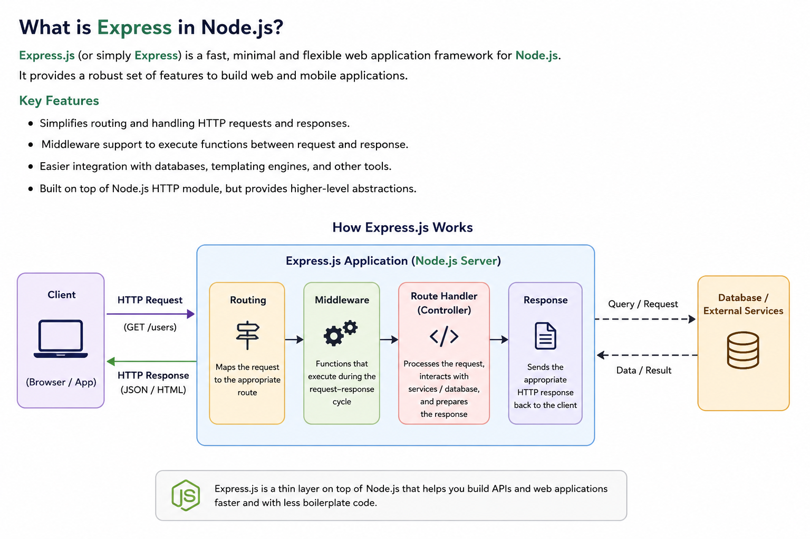

# Node.js, Express, OAuth2 and OIDC - Quick Reference Guide

## 1. What is Node.js?

Node.js is a JavaScript runtime built on Google's V8 JavaScript engine.

It allows JavaScript to run outside the browser and is commonly used for:

- REST APIs
- Microservices
- Real-time applications
- OAuth2/OIDC clients
- API Gateways
- Backend applications

### Key Characteristics

- Event-driven
- Non-blocking I/O
- Single-threaded Event Loop
- High concurrency
- Lightweight and fast

---

# 2. Node.js Architecture



```text
+------------+
| Clients    |
+------------+
       |
       | HTTP Request
       v

+-----------------------------+
|      Node.js Server         |
|                             |
|  +----------------------+   |
|  | Event Loop           |   |
|  +----------------------+   |
|             |               |
|             v               |
|  +----------------------+   |
|  | Event Queue          |   |
|  +----------------------+   |
|             |               |
|             v               |
|  +----------------------+   |
|  | Worker Pool (libuv)  |   |
|  +----------------------+   |
|             |               |
+-------------|---------------+
              |
              v

+-----------------------------+
| File System                 |
| Database                    |
| External APIs               |
| Network Services            |
+-----------------------------+
```

### Request Flow

1. Client sends request.
2. Event Loop receives request.
3. Non-blocking operations are delegated.
4. Worker Pool executes I/O operations.
5. Result is returned via callback.
6. Response is sent back to the client.

---

# 3. Installing Node.js

## Ubuntu

```bash
sudo apt update

sudo apt install nodejs npm

node -v
npm -v
```

## Windows

Download and install from:

https://nodejs.org

Verify:

```bash
node -v
npm -v
```

---

# 4. Creating a Node.js Project

Create a directory:

```bash
mkdir myapp

cd myapp
```

Initialize project:

```bash
npm init -y
```

This creates:

```text
package.json
```

---

# 5. What is Express?

Express is a lightweight web framework for Node.js.



Express provides:

- Routing
- Middleware support
- HTTP request handling
- Session support
- API development

Think of Express as being similar to:

```text
Node.js + Express
≈
Java + Spring MVC
```

---

# 6. Installing Express

```bash
npm install express
```

Project structure:

```text
myapp
|
+-- package.json
+-- node_modules
+-- app.js
```

---

# 7. Simple Express Application

Create:

```javascript
// app.js

const express = require('express');

const app = express();

app.get('/', (req, res) => {
    res.send('Hello World');
});

app.listen(3000, () => {
    console.log('Server running');
});
```

Run:

```bash
node app.js
```

Browse:

```text
http://localhost:3000
```

---

# 8. Express Middleware

Middleware executes before a route handler.

```text
Request
   |
   v
Middleware
   |
   v
Route Handler
   |
   v
Response
```

Example:

```javascript
app.use((req, res, next) => {

    console.log(req.url);

    next();

});
```

Middleware is heavily used for:

- Authentication
- Authorization
- Logging
- Session handling
- JWT validation

---

# 9. Express Architecture

```text
+------------+
| Browser    |
+------------+
      |
      v

+----------------------+
| Express Application  |
|                      |
| Logging Middleware   |
| Session Middleware   |
| OIDC Middleware      |
| JWT Middleware       |
+----------------------+
      |
      v

+----------------------+
| Route Handlers       |
+----------------------+
      |
      v

+----------------------+
| Keycloak / Auth0     |
| Okta / Entra ID      |
+----------------------+
```

---

# 10. OAuth2 and OIDC in Node.js

Express itself does NOT implement OAuth2/OIDC.

OAuth2/OIDC support comes from external libraries.

```text
Express
+
OIDC Library
+
JWT Validation Library
```

---

# 11. OIDC Relying Party (Client)

Typical Authorization Code Flow:

```text
Browser
   |
   | Login
   v

Node.js + Express
   |
   | Authorization Code Flow
   v

Identity Provider
(Keycloak / Auth0 / Okta)
```

Examples:

- Web applications
- Portals
- Employee applications

---

# 12. Recommended OIDC Library

## openid-client

Installation:

```bash
npm install openid-client
```

Capabilities:

- Authorization Code Flow
- PKCE
- Refresh Tokens
- Discovery Endpoint
- UserInfo Endpoint
- Logout
- Token Introspection

Example:

```javascript
import { Issuer } from 'openid-client';

const issuer = await Issuer.discover(
    'https://keycloak.example.com/realms/demo'
);
```

This is currently one of the most widely used standards-based OIDC libraries.

---

# 13. OAuth2 Resource Server

Typical architecture:

```text
Client
   |
Bearer Token
   |
   v

Node.js API
   |
JWT Validation
   |
   v

Keycloak JWKS Endpoint
```

The API validates:

- Signature
- Issuer
- Audience
- Expiry

before processing requests.

---

# 14. Recommended JWT Library

## jose

Installation:

```bash
npm install jose
```

Capabilities:

- JWT Validation
- JWS
- JWE
- JWKS
- OIDC compatible verification

Example:

```javascript
import { jwtVerify } from 'jose';

const { payload } =
    await jwtVerify(token, publicKey);
```

---

# 15. Resource Server Middleware

A common pattern:

```javascript
app.use(jwtMiddleware);
```

Middleware responsibilities:

```text
Request
   |
   v

JWT Middleware

   |
   +--> Invalid -> 401

   |
   +--> Valid
            |
            v

       Route Handler
```

The middleware:

- Extracts Bearer token
- Validates JWT
- Verifies issuer
- Verifies audience
- Populates req.user

---

# 16. Keycloak Integration

Historically:

```text
keycloak-connect
```

was commonly used.

Today many teams prefer:

```text
openid-client
+
jose
```

because they are:

- Standards based
- Vendor neutral
- Easier to migrate between IdPs

Examples:

- Keycloak
- Auth0
- Okta
- Entra ID

---

# 17. Spring Security vs Node.js Mapping

| Spring Security | Node.js |
|-----------------|----------|
| Security Filter Chain | Express Middleware |
| OAuth2 Login | openid-client |
| Resource Server | jose |
| Authentication Object | req.user |
| Session Management | express-session |
| Authorization Rules | Middleware |

---

# 18. Recommended Stack for Keycloak

## OIDC Web Application

```text
Node.js
  +
Express
  +
express-session
  +
openid-client
```

---

## OAuth2 Resource Server

```text
Node.js
  +
Express
  +
jose
  +
JWT Middleware
```

---

## Microservices

```text
Node.js
  +
Express
  +
jose
  +
JWKS Validation
```

---

# 19. Typical Production Architecture

```text
+----------------+
| Browser        |
+----------------+
        |
        v

+----------------+
| Express App    |
+----------------+
        |
        |
        +---- OIDC Login
        |
        v

+----------------+
| Keycloak       |
+----------------+

        |

+----------------+
| Protected API  |
+----------------+
        |
        |
        +---- JWT Validation
        |
        v

+----------------+
| Database       |
+----------------+
```

---

# 20. Learning Path

1. Learn JavaScript basics
2. Install Node.js
3. Learn npm
4. Build simple Express APIs
5. Understand Middleware
6. Learn JWT
7. Learn OAuth2
8. Learn OIDC
9. Integrate Keycloak using openid-client
10. Build Resource Servers using jose
11. Deploy with Docker
12. Deploy on Kubernetes